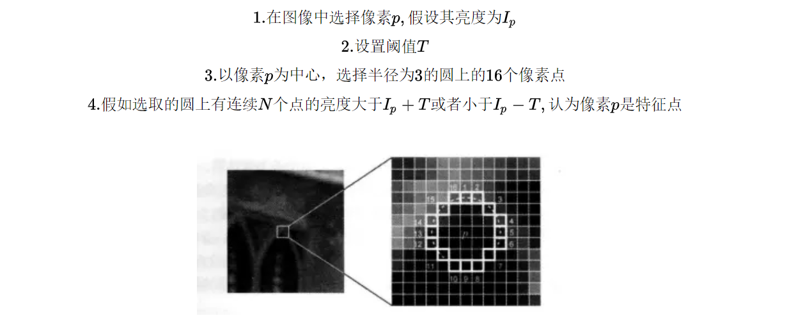
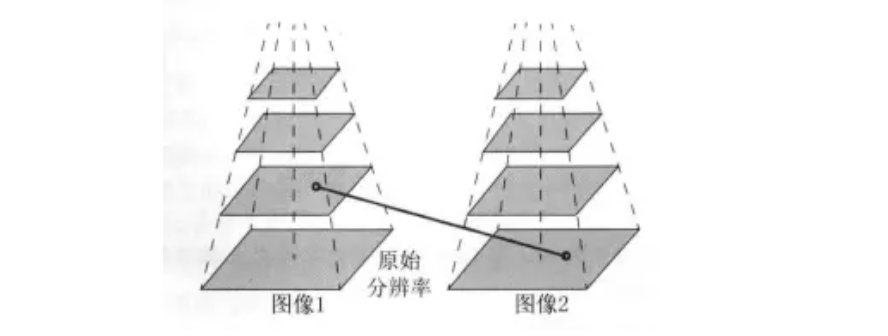
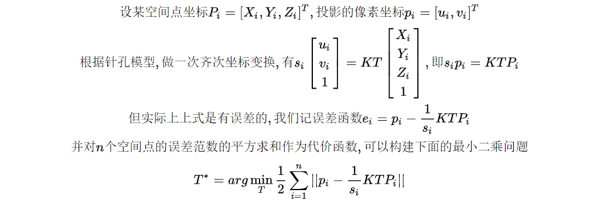

# WEEK1：SLAM学习——视觉里程计

## 1.1 特征点法

### 1.1.1 特征点

视觉里程计的核心问题是**根据图像估计相机运动**。

特征点法的思路是，选取图像中一些具有特征的点，这些点能在帧间保持不变，从而可以在连续的两帧中的都能观察到这些特征点。然后，再根据这些点的像素变化，根据几何学估计相机运动。在经典的视觉SLAM模型中，称之为**路标**。注意，特征点至少要满足相机运动前后保持相对的稳定。

最简单的一类特征点为角点，但是角点的特征不够稳定。

学者们在普通的角点基础上进行了一系列构造，提出了诸如SIFT, SURF, ORB的特征模型。这些特征模型具有以下几个性质：①在不同的图像都可以找到。②不同的特征有不同的表达。③同一图像中，特征点数量远小于像素数量。④特征仅与一小片图像区域相关。

特征点由**关键点**和**描述子**两部分组成。关键点一般指特征点在图像中的位置，描述子通常是一个向量，描述了该关键点周围像素的信息。必须说明，描述子的设计原则是外观相似的特征应该有相似的描述子。

### 1.1.2 ORB特征

ORB特征基于FAST关键点（一种计算非常快的关键点）进行改进，增添了方向信息，又采用了速度极快的二进制描述子BRIEF，在具有实时性的同时同样具有尺度和旋转不变性。

**FAST关键点：**

FAST关键点是一类角点，其核心思想是：如果一个像素与其邻域的像素差别较大，则可能是角点。具体检测过程如下

**Oriented FAST：**

ORB特征在FAST关键点的基础上还进行了改进，添加了尺度和旋转的特征，以保证特征点在缩放或旋转后仍能被检测。

尺度不变性主要由**图像金字塔**进行实现，为图像建立图像金字塔，面对不同尺度下对特征点进行匹配，都可以在金字塔中寻找到对应的匹配，从而实现尺度不变性。

旋转不变性在ORB特征点由灰度质心法实现，其步骤如下

**BRIEF描述子：**

BRIEF描述子是一种二进制描述子，其描述向量由若干个0与1组成。其编码方式是随机选择周围两个像素$p，q$，如果$p$的亮度高于$q$，编码为1，反之为0。重复这个过程$n$次，就可以编码出一个$n$维描述向量。

原始的BRIEF不具有旋转不变性，但经过之前的FAST关键点改良后，可以使用方向信息。ORB特征将BRIEF改良为Steer BRIEF，使得描述子也具有旋转不变性。

### 1.1.3 特征匹配

特征匹配最简单的思路自然是**暴力匹配**，即将前后两帧的特征点做二重遍历，一一计算描述子并比较以找到对应关系，但需要较大的计算量。

在SLAM问题中，一般使用**快速最近邻算法(FLANN)**，其速度较快，不过适用于较多匹配点的场景。

### 1.1.4 运动相机估计

根据相机原理的不同，可以把问题分为下面三种情况。

1.单目相机，需要根据两组2D点估计运动，该问题需要用对极几何解决。

2.双目或RGB-D相机，需要根据两组3D点估计运动，该问题通常采用ICP解决。

3.为了节省计算资源，还可能采用一组3D点和一组2D点估计运动，该问题采用PnP解决。

### 1.1.5 2D-2D：对极几何

**对极约束**

首先设空间点P在第一帧坐标系的坐标如下

根据相机与图像中描述的针孔模型

可以有

对于用齐次坐标表示的像素点坐标，其乘上任何一个向量表示一个投影关系，我们称之为尺度意义下相等，记作

那么，上面的式子可以有如下的推导

将式子重新代回到像素平面（刚才是在归一化平面）

这个式子称为**对极约束**，该约束中包含了平移和旋转。将中间的部分分别记作基础矩阵F和本质矩阵E，写作如下

现在，问题变为了

**①根据配对点的像素位置求解出本质矩阵E和基础矩阵F**

**②根据本质矩阵E和基础矩阵F解得旋转矩阵R和平移向量t**

**单应矩阵**
除了上面提到的本质矩阵和基础矩阵，二视图几何还有一种常见的矩阵：**单应矩阵H**。

它描述了两个平面之间的映射关系，若场景中的特征点都落在同一平面上，则可以通过单应性进行运动估计。先进行数学建模。

回顾尺度意义下相等概念，有

记H为**单应矩阵**。

依照求解本质矩阵E的思路求解单应矩阵H，首先先考虑一对匹配点的情况。

如此一来，一组匹配点就可以构造两组非线性相关的约束，从而自由度为8的单应矩阵只需要四对匹配点就可以求解。

由刚才推导的式子，可以由四对匹配点写成一个线性方程组如下

由此就可以求解单应矩阵H的元素。与本质矩阵E类似，它也需要进行分解来获得R，t，并且也会返回四组解，此时需要确定平面的法向量方向和空间点深度才能得到正确的一组R，t。

### 1.1.6 三角测量

**原理**

SLAM问题中，还需要得到特征点的真实空间位置，由于单目相机无法直接获取深度，还需要通过相机的运动估计特征点的深度。解决这个问题通过**三角测量**来完成。

重新将尺度代回，而不是使用尺度意义下等价

已知匹配特征点的归一化平面坐标以及运动估计R，t，要求解特征点在两视图下的深度s。

根据这个思路，假设先求解图像1中特征点的深度

不过由于噪声存在，估计的R，t未必使上式严格成立，所以一般是采取最小二乘来求解，即

### 1.1.7 3D-2D:PnP

PnP是求解3D到2D点对运动的方法。它描述了当知道n个3D空间点的真实位置及其投影位置时，如何估计相机的位姿。

PnP问题有很多种求解方法，比如用三对点估计相机运动的P3P，直接线性变换(DLT)，EPnP。除此之外，还可以采用非线性优化的方式，构建最小二乘问题求解，在这个模型下构建的最小二乘问题称为光束法平差（Bundle Adjustment,BA）。

**直接线性变换**
对3D-2D点对进行数学建模

其中，矩阵t包含了旋转和平移信息。通过像素齐次坐标的最后一行约去s，可以得到两个有关系数矩阵t的约束，t一共有12个自变量，最少需要6对没有退化情况的点就可以求解出矩阵t。

**P3P**
对于如下的三对3D-2D点，$A,B,C$在世界坐标系下已知真实坐标（可以根据上一帧的位姿和上一帧的针孔模型获得），$a,b,c$是在新的一帧的投影坐标。本质上，我们只要计算出投影点在相机坐标系下的真实坐标，再根据两个坐标系的变换获得其变换矩阵即可。

对最后的二元二次方程进行求解即可。求解后可以获得投影点在相机坐标系下的3D点，在此基础上进行3D-3D点对的匹配即可。

**光束法平差**

光束法平差是基于非线性优化的，光束法平差将相机位姿和空间点同时作为优化变量进行优化。

考虑n个三维空间点$P$（可以是前一帧的相机坐标系也可以是世界坐标系下的）及其投影$p$，我们要计算相机的位姿$R，t$，它的李群为$T$。

该最小二乘问题实际上是找到一个位姿，使得空间点集通过针孔模型投影到像素平面上的点集与实际在这一帧观测到的点集之间的误差和最小。误差项即是投影位置和观测位置作差，称为**重投影误差**。

### 1.1.8 3D-3D：ICP

首先考虑两个已经匹配好的3D点集

现在，需要找到一个欧式变换R,t，使得下面的误差项范数平方和最小

解决这个问题有两种方法：**SVD方法**以及**非线性优化方法**。

**SVD方法**
定义两组点的质心，并计算去质心坐标

再根据以下最小二乘问题计算旋转矩阵R

再根据第二步计算的R求解t

**非线性优化方法**
构建最小二乘问题

使用李代数左乘扰动模型，得到其一阶导数（雅可比矩阵）

ICP问题有一个特殊的性质，其有唯一解时必是全局最小值解，尽管其有可能出现无穷多组解。因此，ICP问题的初值并没有那么重要。 

