# WEEK2：ROS实验_TF坐标变换实操

## 2.1 需求分析

程序启动之初: 产生两只乌龟，中间的乌龟(A) 和 左下乌龟(B), B 会自动运行至A的位置，并且键盘控制时，只是控制 A 的运动，但是 B 可以跟随 A 运行

**实现分析:**

乌龟跟随实现的核心，是乌龟A和B都要发布相对世界坐标系的坐标信息，然后，订阅到该信息需要转换获取A相对于B坐标系的信息，最后，再生成速度信息，并控制B运动。

1. 启动乌龟显示节点
2. 在乌龟显示窗体中生成一只新的乌龟(需要使用服务)
3. 编写两只乌龟发布坐标信息的节点
4. 编写订阅节点订阅坐标信息并生成新的相对关系生成速度信息

**实现流程:**
1. 新建功能包，添加依赖

2. 编写服务客户端，用于生成一只新的乌龟

3. 编写发布方，发布两只乌龟的坐标信息

4. 编写订阅方，订阅两只乌龟信息，生成速度信息并发布

5. 运行


## 2.2 创建功能包

创建项目功能包依赖于 `tf2、tf2_ros、tf2_geometry_msgs、roscpp rospy std_msgs geometry_msgs、turtlesim`

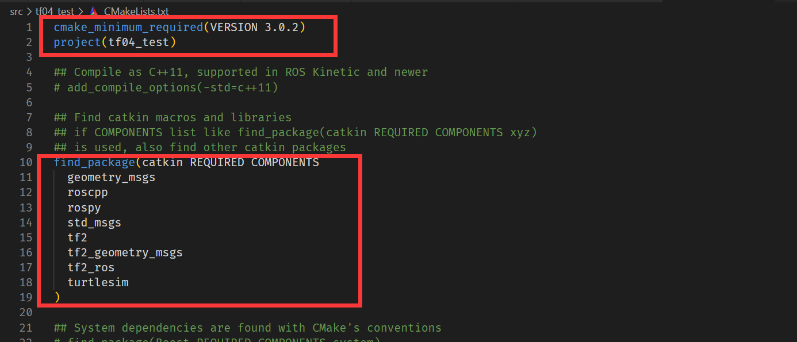

## 2.3 服务客户端(生成乌龟)

```c
/* 
    创建第二只小乌龟
 */
#include "ros/ros.h"
#include "turtlesim/Spawn.h"

int main(int argc, char *argv[])
{

    setlocale(LC_ALL,"");

    //执行初始化
    ros::init(argc,argv,"create_turtle");
    //创建节点
    ros::NodeHandle nh;
    //创建服务客户端
    ros::ServiceClient client = nh.serviceClient<turtlesim::Spawn>("/spawn");

    ros::service::waitForService("/spawn");
    turtlesim::Spawn spawn;
    spawn.request.name = "turtle2";
    spawn.request.x = 1.0;
    spawn.request.y = 2.0;
    spawn.request.theta = 3.12415926;
    bool flag = client.call(spawn);
    if (flag)
    {
        ROS_INFO("乌龟%s创建成功!",spawn.response.name.c_str());
    }
    else
    {
        ROS_INFO("乌龟2创建失败!");
    }

    ros::spin();

    return 0;
}
```

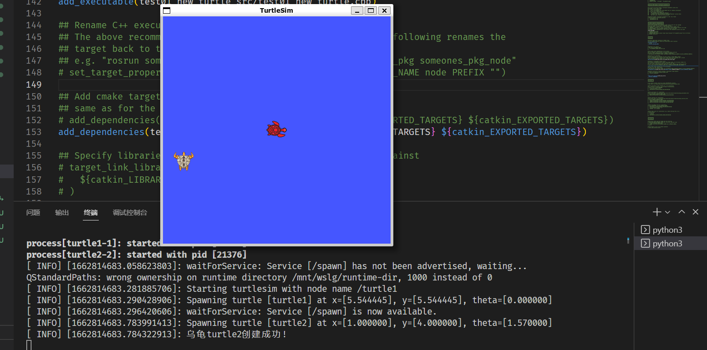
单纯生成两只乌龟

此时的计算图

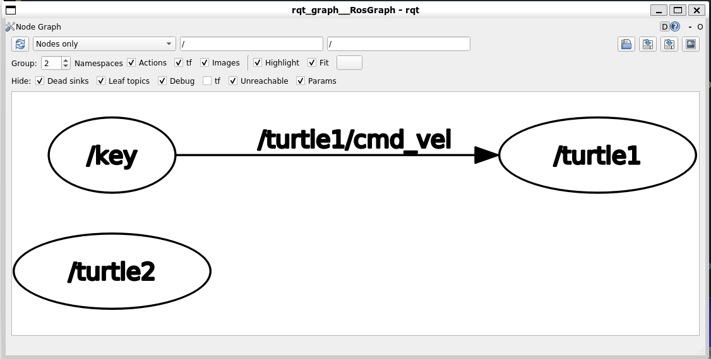

只有一直乌龟可以控制运动
## 2.4 发布方(发布两只乌龟的坐标信息)

可以订阅乌龟的位姿信息，然后再转换成坐标信息，两只乌龟的实现逻辑相同，只是订阅的话题名称，生成的坐标信息等稍有差异，可以将差异部分通过参数传入:

- 该节点需要启动两次
- 每次启动时都需要传入乌龟节点名称(第一次是 turtle1 第二次是 turtle2)

```c
/*  
    该文件实现:需要订阅 turtle1 和 turtle2 的 pose，然后广播相对 world 的坐标系信息

    注意: 订阅的两只 turtle,除了命名空间(turtle1 和 turtle2)不同外,
          其他的话题名称和实现逻辑都是一样的，
          所以我们可以将所需的命名空间通过 args 动态传入

    实现流程:
        1.包含头文件
        2.初始化 ros 节点
        3.解析传入的命名空间
        4.创建 ros 句柄
        5.创建订阅对象
        6.回调函数处理订阅的 pose 信息
            6-1.创建 TF 广播器
            6-2.将 pose 信息转换成 TransFormStamped
            6-3.发布
        7.spin

*/
//1.包含头文件
#include "ros/ros.h"
#include "turtlesim/Pose.h"
#include "tf2_ros/transform_broadcaster.h"
#include "tf2/LinearMath/Quaternion.h"
#include "geometry_msgs/TransformStamped.h"
//保存乌龟名称
std::string turtle_name;


void doPose(const turtlesim::Pose::ConstPtr& pose){
    //  6-1.创建 TF 广播器 ---------------------------------------- 注意 static
    static tf2_ros::TransformBroadcaster broadcaster;
    //  6-2.将 pose 信息转换成 TransFormStamped
    geometry_msgs::TransformStamped tfs;
    tfs.header.frame_id = "world";
    tfs.header.stamp = ros::Time::now();
    tfs.child_frame_id = turtle_name;
    tfs.transform.translation.x = pose->x;
    tfs.transform.translation.y = pose->y;
    tfs.transform.translation.z = 0.0;
    tf2::Quaternion qtn;
    qtn.setRPY(0,0,pose->theta);
    tfs.transform.rotation.x = qtn.getX();
    tfs.transform.rotation.y = qtn.getY();
    tfs.transform.rotation.z = qtn.getZ();
    tfs.transform.rotation.w = qtn.getW();
    //  6-3.发布
    broadcaster.sendTransform(tfs);

} 

int main(int argc, char *argv[])
{
    setlocale(LC_ALL,"");
    // 2.初始化 ros 节点
    ros::init(argc,argv,"pub_tf");
    // 3.解析传入的命名空间
    if (argc != 2)
    {
        ROS_ERROR("请传入正确的参数");
    } else {
        turtle_name = argv[1];
        ROS_INFO("乌龟 %s 坐标发送启动",turtle_name.c_str());
    }

    // 4.创建 ros 句柄
    ros::NodeHandle nh;
    // 5.创建订阅对象
    ros::Subscriber sub = nh.subscribe<turtlesim::Pose>(turtle_name + "/pose",1000,doPose);
    //     6.回调函数处理订阅的 pose 信息
    //         6-1.创建 TF 广播器
    //         6-2.将 pose 信息转换成 TransFormStamped
    //         6-3.发布
    // 7.spin
    ros::spin();
    return 0;
}
```

启动rviz，观察两只乌龟和world坐标系关系

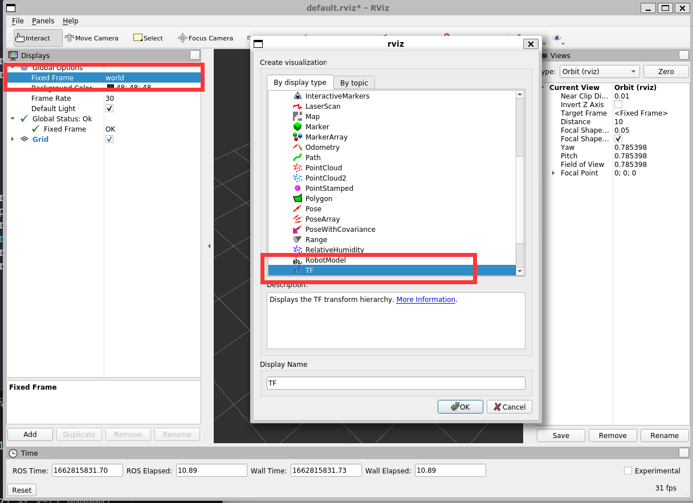

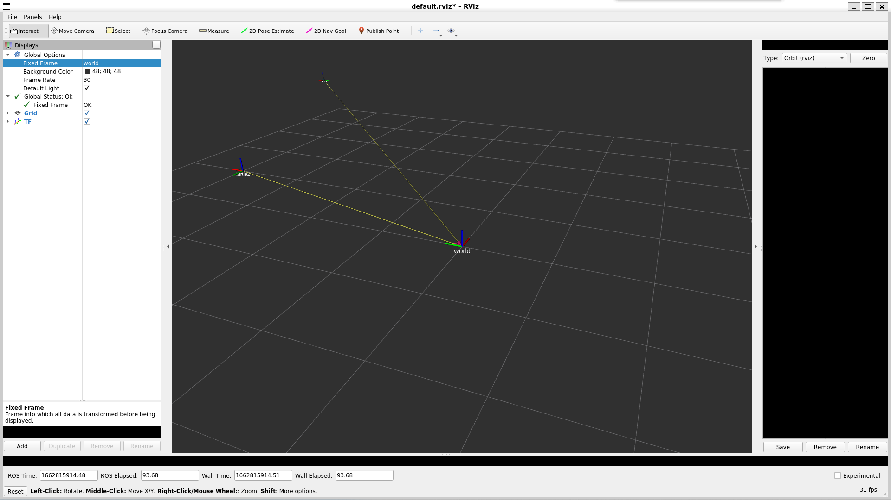

如上图所示

## 2.5 订阅方(解析坐标信息并生成速度信息)

```c
/*  
    订阅 turtle1 和 turtle2 的 TF 广播信息，查找并转换时间最近的 TF 信息
    将 turtle1 转换成相对 turtle2 的坐标，在计算线速度和角速度并发布

    实现流程:
        1.包含头文件
        2.初始化 ros 节点
        3.创建 ros 句柄
        4.创建 TF 订阅对象
        5.处理订阅到的 TF
        6.spin

*/
//1.包含头文件
#include "ros/ros.h"
#include "tf2_ros/transform_listener.h"
#include "geometry_msgs/TransformStamped.h"
#include "geometry_msgs/Twist.h"

int main(int argc, char *argv[])
{
    setlocale(LC_ALL,"");
    // 2.初始化 ros 节点
    ros::init(argc,argv,"sub_TF");
    // 3.创建 ros 句柄
    ros::NodeHandle nh;
    // 4.创建 TF 订阅对象
    tf2_ros::Buffer buffer;
    tf2_ros::TransformListener listener(buffer);
    // 5.处理订阅到的 TF

    // 需要创建发布 /turtle2/cmd_vel 的 publisher 对象

    ros::Publisher pub = nh.advertise<geometry_msgs::Twist>("/turtle2/cmd_vel",1000);

    ros::Rate rate(10);
    while (ros::ok())
    {
        try
        {
            //5-1.先获取 turtle1 相对 turtle2 的坐标信息
            geometry_msgs::TransformStamped tfs = buffer.lookupTransform("turtle2","turtle1",ros::Time(0));

            //5-2.根据坐标信息生成速度信息 -- geometry_msgs/Twist.h
            geometry_msgs::Twist twist;
            twist.linear.x = 0.5 * sqrt(pow(tfs.transform.translation.x,2) + pow(tfs.transform.translation.y,2));
            twist.angular.z = 4 * atan2(tfs.transform.translation.y,tfs.transform.translation.x);

            //5-3.发布速度信息 -- 需要提前创建 publish 对象
            pub.publish(twist);
        }
        catch(const std::exception& e)
        {
            // std::cerr << e.what() << '\n';
            ROS_INFO("错误提示:%s",e.what());
        }


        rate.sleep();
        // 6.spin
        ros::spinOnce();
    }

    return 0;
}
```

## 2.6 配置 CMakeList.txt 并编译

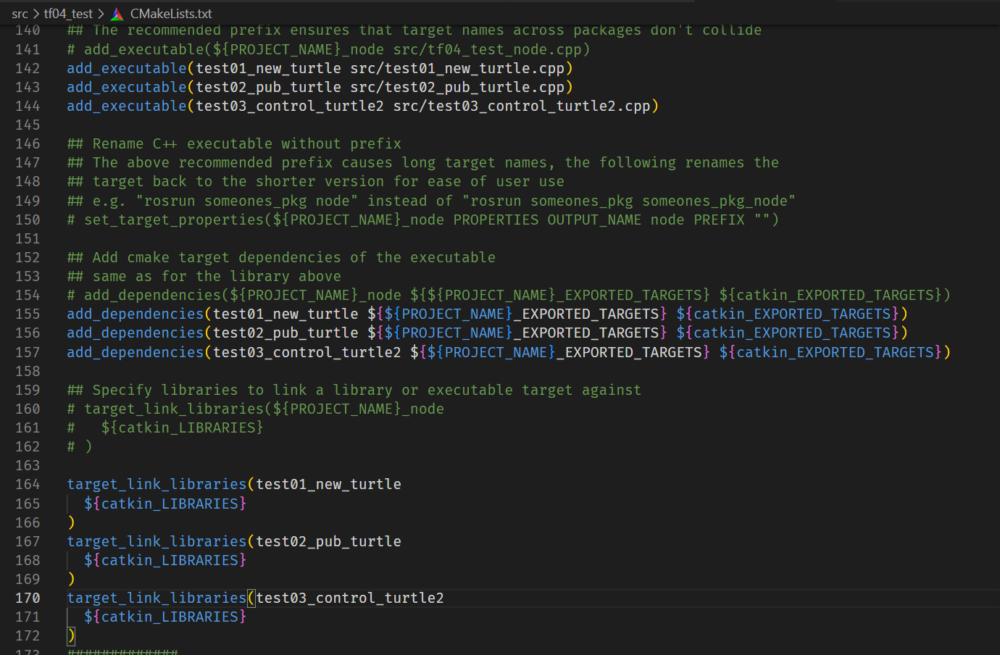

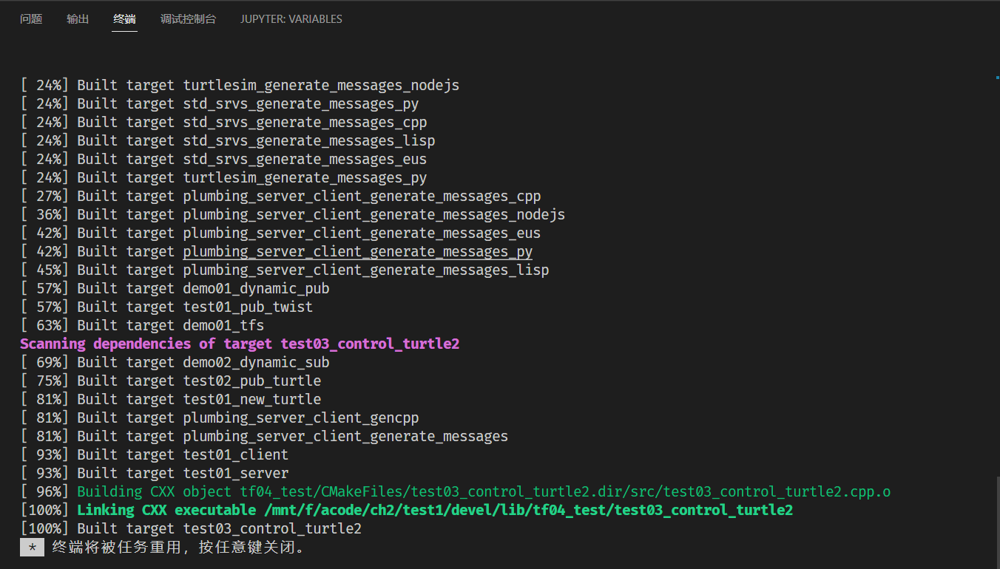

编译完成


## 2.7 运行

编写 launch 文件组织需要运行的节点

```html
<launch>
    <node pkg="turtlesim" type="turtlesim_node" name="turtle1" output="screen" />
    <node pkg="turtlesim" type="turtle_teleop_key" name="key" output="screen" />
    <node pkg="tf04_test" type="test01_new_turtle" name="turtle2" output="screen" />

    <node pkg="tf04_test" type="test02_pub_turtle" name="pub1" args="turtle1" output="screen" />
    <node pkg="tf04_test" type="test02_pub_turtle" name="pub2" args="turtle2" output="screen" />


    <node pkg="tf04_test" type="test03_control_turtle2" name="control"  output="screen" />

</launch>
```
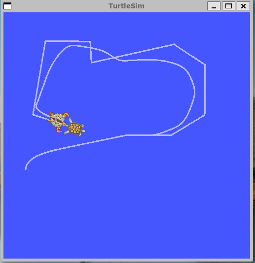

实现第二只乌龟跟随第一只运动

计算图如下

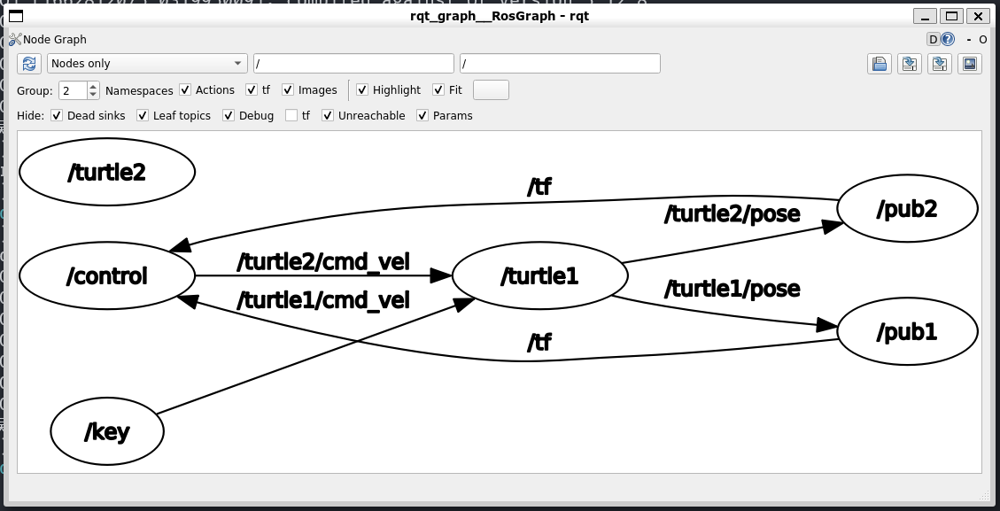

启动 rviz 更直观看到两只乌龟的运动

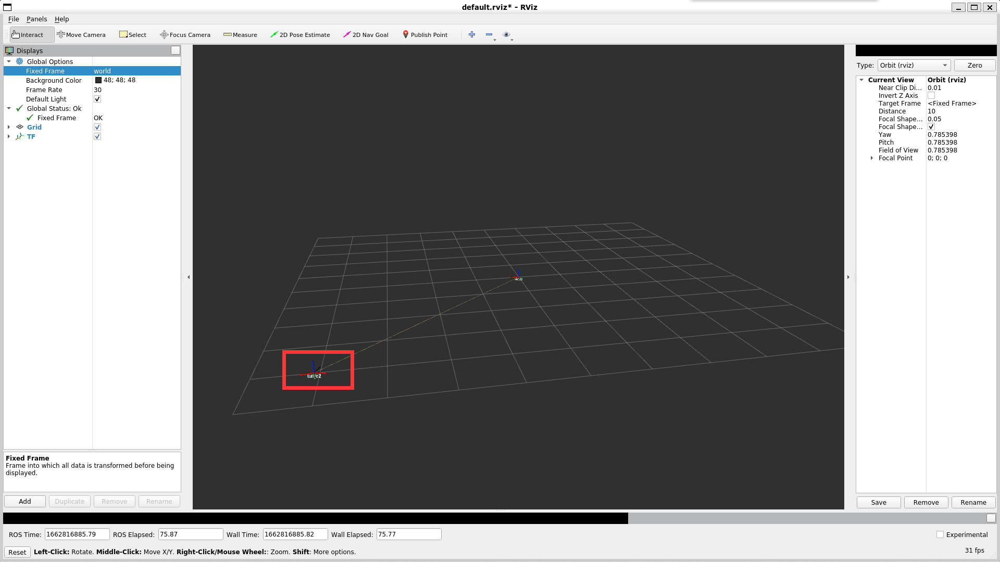

## 2.8 坐标系关系查看

输入`rosrun tf2_tools view_frames.py`生成pdf文件，查看两乌龟和world坐标系关系

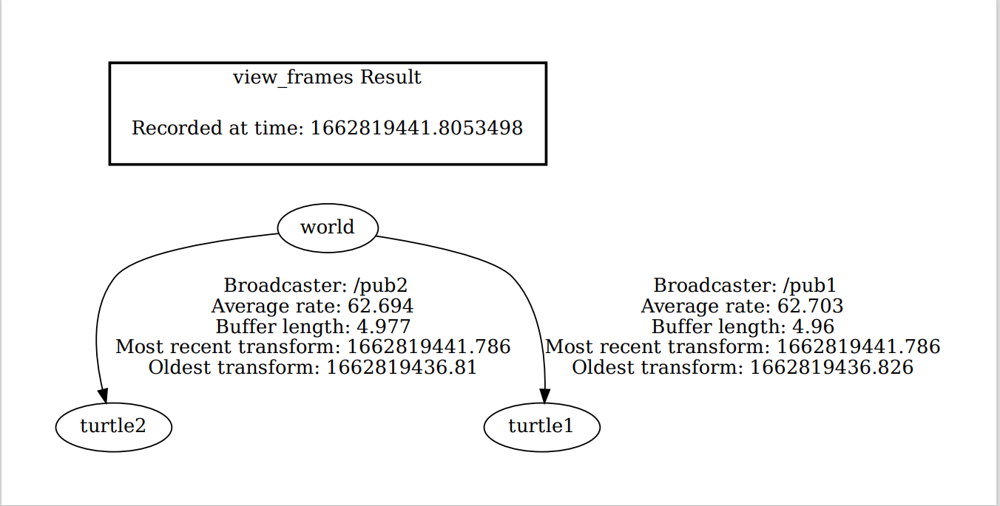