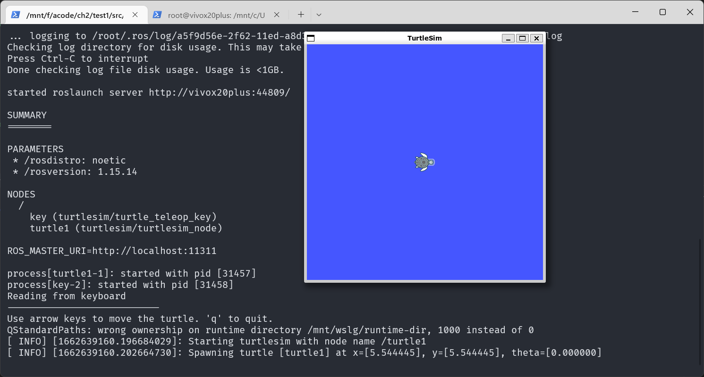
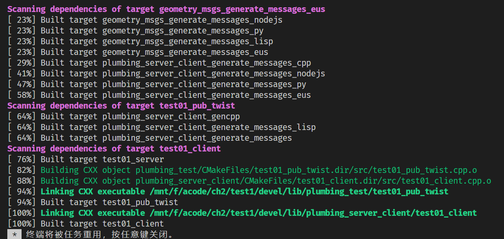
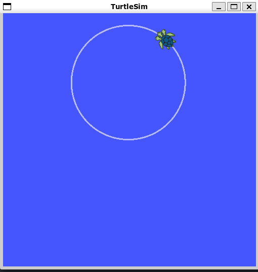
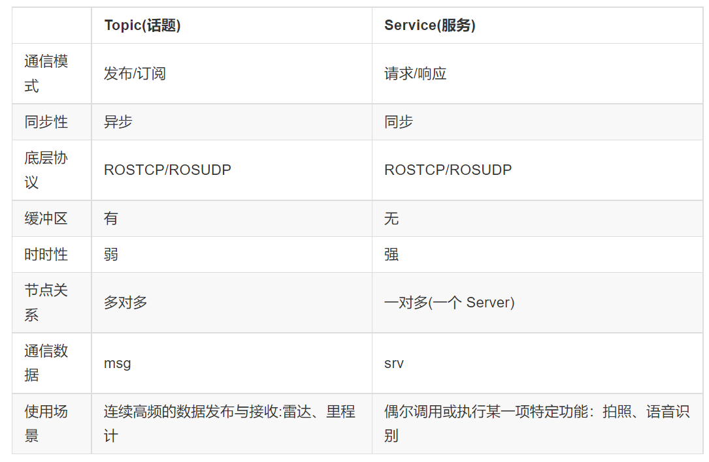
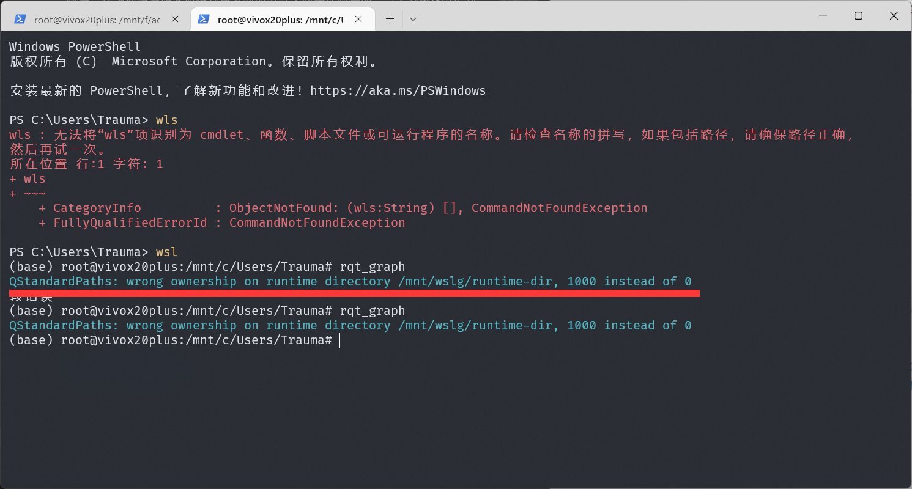

# WEEK2：ROS实验_乌龟圆周运动

## 2.1 需求分析

**需求描述:** 编码实现乌龟运动控制，让小乌龟做圆周运动。

**实现分析:**

1. 乌龟运动控制实现，关键节点有两个，一个是乌龟运动显示节点 turtlesim_node，另一个是控制节点，二者是订阅发布模式实现通信的，乌龟运动显示节点直接调用即可，运动控制节点之前是使用的 turtle_teleop_key通过键盘 控制，现在需要自定义控制节点。
2. 控制节点自实现时，首先需要了解控制节点与显示节点通信使用的话题与消息，可以使用ros命令结合计算图来获取。
3. 了解了话题与消息之后，通过 C++ 或 Python 编写运动控制节点，通过指定的话题，按照一定的逻辑发布消息即可。

**实现流程:**

1. 通过计算图结合ros命令获取话题与消息信息。
2. 编码实现运动控制节点。
3. 启动 roscore、turtlesim_node 以及自定义的控制节点，查看运行结果。

## 2.2 编写launch文件启动乌龟

新建一个launch文件夹

编写 start_turtle.launch 文件


输入`roslaunch plumbing_test start_turtle.launch` 启动

 

启动成功

## 2.3 实现发布节点（c++）

代码如下：
```c
/*
    编写 ROS 节点，控制小乌龟画圆

    准备工作:
        1.获取topic(已知: /turtle1/cmd_vel)
        2.获取消息类型(已知: geometry_msgs/Twist)
        3.运行前，注意先启动 turtlesim_node 节点

    实现流程:
        1.包含头文件
        2.初始化 ROS 节点
        3.创建发布者对象
        4.循环发布运动控制消息
*/

#include "ros/ros.h"
#include "geometry_msgs/Twist.h"

int main(int argc, char *argv[])
{
    setlocale(LC_ALL,"");
    // 2.初始化 ROS 节点
    ros::init(argc,argv,"control");
    ros::NodeHandle nh;
    // 3.创建发布者对象
    ros::Publisher pub = nh.advertise<geometry_msgs::Twist>("/turtle1/cmd_vel",1000);
    // 4.循环发布运动控制消息
    //4-1.组织消息
    geometry_msgs::Twist msg;
    msg.linear.x = 1.0;
    msg.linear.y = 0.0;
    msg.linear.z = 0.0;

    msg.angular.x = 0.0;
    msg.angular.y = 0.0;
    msg.angular.z = 2.0;

    //4-2.设置发送频率
    ros::Rate r(10);
    //4-3.循环发送
    while (ros::ok())
    {
        pub.publish(msg);

        ros::spinOnce();
    }


    return 0;
}
```
## 2.4 配置 CMakeLists.txt


配置完成



编译完成

## 2.5 执行

首先，启动 roscore；

然后启动乌龟显示节点；

最后执行运动控制节点；



运行成功

计算图：


## 2.6 通信机制比较

三种通信机制中，参数服务器是一种数据共享机制，可以在不同的节点之间共享数据，话题通信与服务通信是在不同的节点之间传递数据的，三者是ROS中最基础也是应用最为广泛的通信机制。

这其中，话题通信和服务通信有一定的相似性也有本质上的差异，在此将二者做一下简单比较:

二者的实现流程是比较相似的，都是涉及到四个要素:

- 要素1: 消息的发布方/客户端(Publisher/Client)
- 要素2: 消息的订阅方/服务端(Subscriber/Server)
- 要素3: 话题名称(Topic/Service)
- 要素4: 数据载体(msg/srv)

可以概括为: 两个节点通过话题关联到一起，并使用某种类型的数据载体实现数据传输。

二者的实现也是有本质差异的，具体比较如下:



不同通信机制有一定的互补性，都有各自适应的应用场景。尤其是话题与服务通信，需要结合具体的应用场景与二者的差异，选择合适的通信机制。

## 2.7 遇到的问题

在使用计算图和启动小乌龟时，会报错 `QStandardPaths: wrong ownership on runtime directory /mnt/wslg/runtime-dir, 1000 instead of 0`



目前在网上也没有找到合适的解决办法，在此记录，后续还需要请教师兄或者锦波。