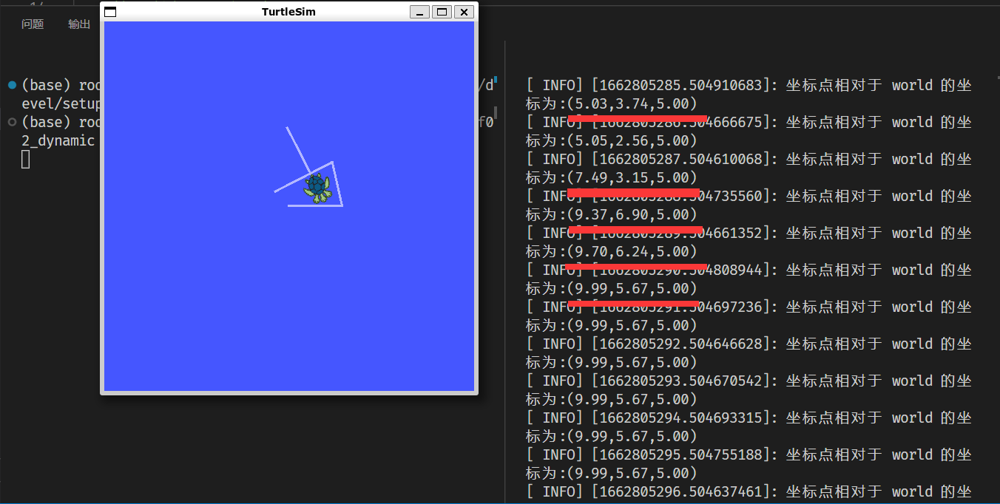

# WEEK2：ROS实验_静态坐标变换

## 2.1 需求分析

所谓动态坐标变换，是指两个坐标系之间的相对位置是变化的。

启动 turtlesim_node,该节点中窗体有一个世界坐标系(左下角为坐标系原点)，乌龟是另一个坐标系，键盘控制乌龟运动，将两个坐标系的相对位置动态发布。

**实现分析:**

1. 乌龟本身不但可以看作坐标系，也是世界坐标系中的一个坐标点

2. 订阅 turtle1/pose,可以获取乌龟在世界坐标系的 x坐标、y坐标、偏移量以及线速度和角速度

3. 将 pose 信息转换成坐标系相对信息并发布

**实现流程:**

1. 新建功能包，添加依赖

2. 创建坐标相对关系发布方(同时需要订阅乌龟位姿信息)

3. 创建坐标相对关系订阅方

4. 执行

## 2.2 创建功能包

创建项目功能包依赖于 `tf2、tf2_ros、tf2_geometry_msgs、roscpp rospy std_msgs geometry_msgs、turtlesim`


## 2.3 发布方实现

```c
/*  
    动态的坐标系相对姿态发布(一个坐标系相对于另一个坐标系的相对姿态是不断变动的)

    需求: 启动 turtlesim_node,该节点中窗体有一个世界坐标系(左下角为坐标系原点)，乌龟是另一个坐标系，键盘
    控制乌龟运动，将两个坐标系的相对位置动态发布

    实现分析:
        1.乌龟本身不但可以看作坐标系，也是世界坐标系中的一个坐标点
        2.订阅 turtle1/pose,可以获取乌龟在世界坐标系的 x坐标、y坐标、偏移量以及线速度和角速度
        3.将 pose 信息转换成 坐标系相对信息并发布

    实现流程:
        1.包含头文件
        2.初始化 ROS 节点
        3.创建 ROS 句柄
        4.创建订阅对象
        5.回调函数处理订阅到的数据(实现TF广播)
            5-1.创建 TF 广播器
            5-2.创建 广播的数据(通过 pose 设置)
            5-3.广播器发布数据
        6.spin
*/
// 1.包含头文件
#include "ros/ros.h"
#include "turtlesim/Pose.h"
#include "tf2_ros/transform_broadcaster.h"
#include "geometry_msgs/TransformStamped.h"
#include "tf2/LinearMath/Quaternion.h"

void doPose(const turtlesim::Pose::ConstPtr& pose){
    //  5-1.创建 TF 广播器
    static tf2_ros::TransformBroadcaster broadcaster;
    //  5-2.创建 广播的数据(通过 pose 设置)
    geometry_msgs::TransformStamped tfs;
    //  |----头设置
    tfs.header.frame_id = "world";
    tfs.header.stamp = ros::Time::now();

    //  |----坐标系 ID
    tfs.child_frame_id = "turtle1";

    //  |----坐标系相对信息设置
    tfs.transform.translation.x = pose->x;
    tfs.transform.translation.y = pose->y;
    tfs.transform.translation.z = 0.0; // 二维实现，pose 中没有z，z 是 0
    //  |--------- 四元数设置
    tf2::Quaternion qtn;
    qtn.setRPY(0,0,pose->theta);
    tfs.transform.rotation.x = qtn.getX();
    tfs.transform.rotation.y = qtn.getY();
    tfs.transform.rotation.z = qtn.getZ();
    tfs.transform.rotation.w = qtn.getW();


    //  5-3.广播器发布数据
    broadcaster.sendTransform(tfs);
}

int main(int argc, char *argv[])
{
    setlocale(LC_ALL,"");
    // 2.初始化 ROS 节点
    ros::init(argc,argv,"dynamic_tf_pub");
    // 3.创建 ROS 句柄
    ros::NodeHandle nh;
    // 4.创建订阅对象
    ros::Subscriber sub = nh.subscribe<turtlesim::Pose>("/turtle1/pose",1000,doPose);
    //     5.回调函数处理订阅到的数据(实现TF广播)
    //        
    // 6.spin
    ros::spin();
    return 0;
}
```
## 2.4 订阅方实现

```c
//1.包含头文件
#include "ros/ros.h"
#include "tf2_ros/transform_listener.h"
#include "tf2_ros/buffer.h"
#include "geometry_msgs/PointStamped.h"
#include "tf2_geometry_msgs/tf2_geometry_msgs.h" //注意: 调用 transform 必须包含该头文件

int main(int argc, char *argv[])
{
    setlocale(LC_ALL,"");
    // 2.初始化 ROS 节点
    ros::init(argc,argv,"dynamic_tf_sub");
    ros::NodeHandle nh;
    // 3.创建 TF 订阅节点
    tf2_ros::Buffer buffer;
    tf2_ros::TransformListener listener(buffer);

    ros::Rate r(1);
    while (ros::ok())
    {
    // 4.生成一个坐标点(相对于子级坐标系)
        geometry_msgs::PointStamped point_laser;
        point_laser.header.frame_id = "turtle1";
        point_laser.header.stamp = ros::Time();
        point_laser.point.x = 2.0;
        point_laser.point.y = 3.0;
        point_laser.point.z = 5.0;
    // 5.转换坐标点(相对于父级坐标系)
        //新建一个坐标点，用于接收转换结果  
        //--------------使用 try 语句或休眠，否则可能由于缓存接收延迟而导致坐标转换失败------------------------
        try
        {
            geometry_msgs::PointStamped point_base;
            point_base = buffer.transform(point_laser,"world");
            ROS_INFO("坐标点相对于 world 的坐标为:(%.2f,%.2f,%.2f)",point_base.point.x,point_base.point.y,point_base.point.z);

        }
        catch(const std::exception& e)
        {
            // std::cerr << e.what() << '\n';
            ROS_INFO("程序异常:%s",e.what());
        }


        r.sleep();  
        ros::spinOnce();
    }


    return 0;
}
```

## 2.5 配置 CMakeList.txt 并编译


编译成功

## 2.6 执行

启动 roscore

启动乌龟节点


启动发布方节点

启动订阅方节点


输出当前乌龟所在位置

使用键盘控制乌龟移动，观察坐标系变化



计算图如下


## 2.7 借助 rviz 显示坐标系关系

输入`rosrun rviz rviz`


观察当前乌龟所在位置和 world 坐标系的位置关系


键盘控制乌龟移动


再次观察当前乌龟所在位置和 world 坐标系位置关系的变化


实验完成。