# WEEK2：ROS实验_多坐标变换

## 2.1 需求分析

现有坐标系统，父级坐标系统 world,下有两子级系统 son1，son2，son1 相对于 world，以及 son2 相对于 world 的关系是已知的，求 son1原点在 son2中的坐标，又已知在 son1中一点的坐标，要求求出该点在 son2 中的坐标

**实现分析:**

1. 首先，需要发布 son1 相对于 world，以及 son2 相对于 world 的坐标消息
2. 然后，需要订阅坐标发布消息，并取出订阅的消息，借助于 3.tf2 实现 son1 和 son2 的转换
3. 最后，还要实现坐标点的转换


**实现流程:**

1. 新建功能包，添加依赖

2. 创建坐标相对关系发布方(需要发布两个坐标相对关系)

3. 创建坐标相对关系订阅方

4. 执行

## 2.2 1.创建功能包

创建项目功能包依赖于 `tf2、tf2_ros、tf2_geometry_msgs、roscpp rospy std_msgs geometry_msgs`

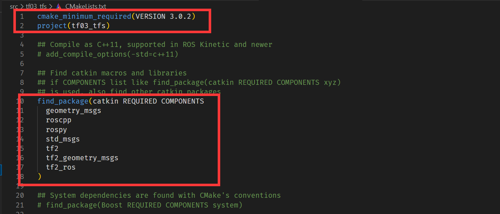

## 2.3 发布方实现

为了方便，使用静态坐标变换发布

```html
<launch>
    <node pkg="tf2_ros" type="static_transform_publisher" name="son1" args="5 0 0 0 0 0 /world /son1" output="screen" />
    <node pkg="tf2_ros" type="static_transform_publisher" name="son2" args="3 0 0 0 0 0 /world /son2" output="screen" />
</launch>
```

## 2.4 订阅方实现

```c
/*

需求:
    现有坐标系统，父级坐标系统 world,下有两子级系统 son1，son2，
    son1 相对于 world，以及 son2 相对于 world 的关系是已知的，
    求 son1 与 son2中的坐标关系，又已知在 son1中一点的坐标，要求求出该点在 son2 中的坐标
实现流程:
    1.包含头文件
    2.初始化 ros 节点
    3.创建 ros 句柄
    4.创建 TF 订阅对象
    5.解析订阅信息中获取 son1 坐标系原点在 son2 中的坐标
      解析 son1 中的点相对于 son2 的坐标
    6.spin

*/
//1.包含头文件
#include "ros/ros.h"
#include "tf2_ros/transform_listener.h"
#include "tf2/LinearMath/Quaternion.h"
#include "tf2_geometry_msgs/tf2_geometry_msgs.h"
#include "geometry_msgs/TransformStamped.h"
#include "geometry_msgs/PointStamped.h"

int main(int argc, char *argv[])
{   setlocale(LC_ALL,"");
    // 2.初始化 ros 节点
    ros::init(argc,argv,"sub_frames");
    // 3.创建 ros 句柄
    ros::NodeHandle nh;
    // 4.创建 TF 订阅对象
    tf2_ros::Buffer buffer; 
    tf2_ros::TransformListener listener(buffer);
    // 5.解析订阅信息中获取 son1 坐标系原点在 son2 中的坐标
    ros::Rate r(1);
    while (ros::ok())
    {
        try
        {
        //   解析 son1 中的点相对于 son2 的坐标
            geometry_msgs::TransformStamped tfs = buffer.lookupTransform("son2","son1",ros::Time(0));
            ROS_INFO("Son1 相对于 Son2 的坐标关系:父坐标系ID=%s",tfs.header.frame_id.c_str());
            ROS_INFO("Son1 相对于 Son2 的坐标关系:子坐标系ID=%s",tfs.child_frame_id.c_str());
            ROS_INFO("Son1 相对于 Son2 的坐标关系:x=%.2f,y=%.2f,z=%.2f",
                    tfs.transform.translation.x,
                    tfs.transform.translation.y,
                    tfs.transform.translation.z
                    );

            // 坐标点解析
            geometry_msgs::PointStamped ps;
            ps.header.frame_id = "son1";
            ps.header.stamp = ros::Time::now();
            ps.point.x = 1.0;
            ps.point.y = 2.0;
            ps.point.z = 3.0;

            geometry_msgs::PointStamped psAtSon2;
            psAtSon2 = buffer.transform(ps,"son2");
            ROS_INFO("在 Son2 中的坐标:x=%.2f,y=%.2f,z=%.2f",
                    psAtSon2.point.x,
                    psAtSon2.point.y,
                    psAtSon2.point.z
                    );
        }
        catch(const std::exception& e)
        {
            // std::cerr << e.what() << '\n';
            ROS_INFO("异常信息:%s",e.what());
        }


        r.sleep();
        // 6.spin
        ros::spinOnce();
    }
    return 0;
}
```

## 2.5 配置 CMakeList.txt 并编译

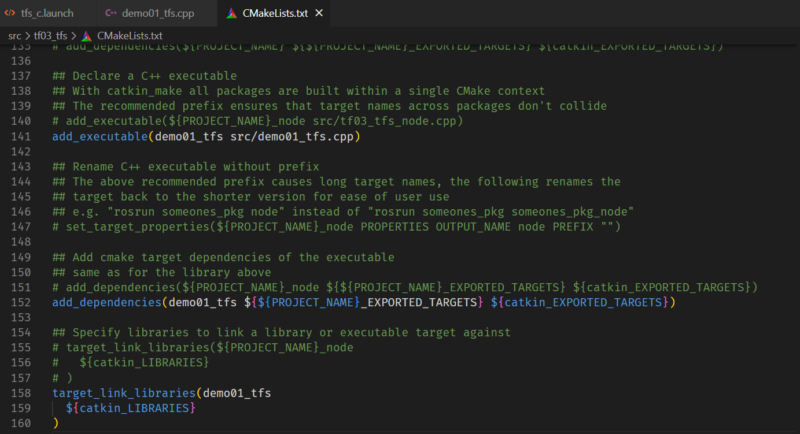

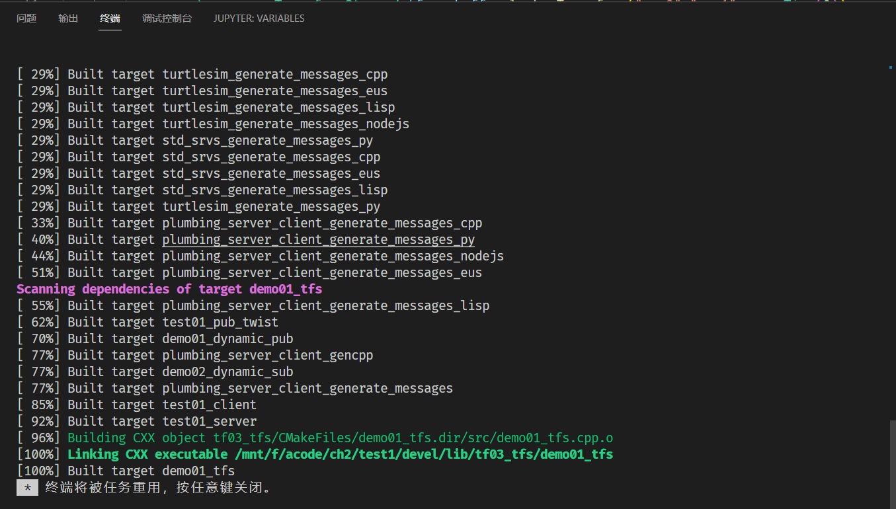

编译完成

## 2.6 执行

启动 roscore

输入`roslaunch tf03_tfs tfs_c.launch`，启动发布方

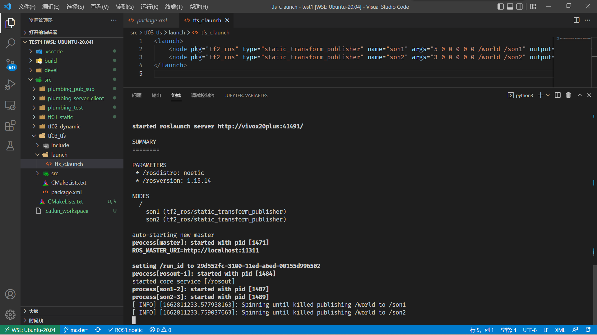

启动订阅节点

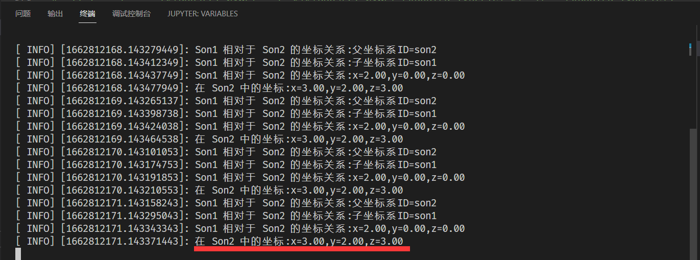

输出成功

## 2.7 借助于rviz显示坐标系关系

输入`rosrun rviz rviz`

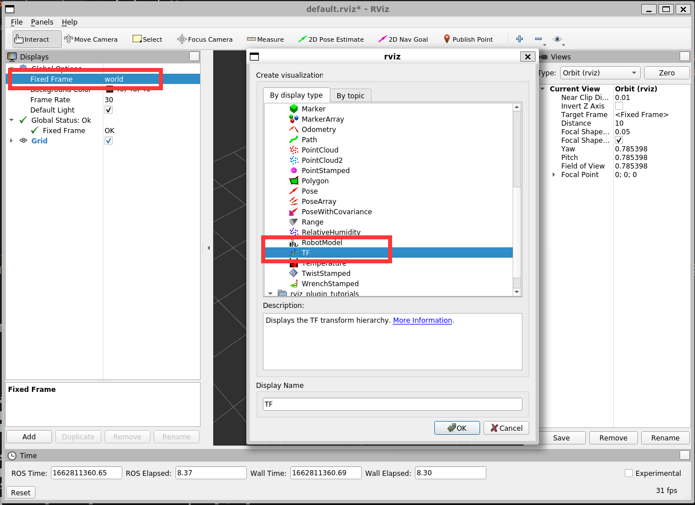

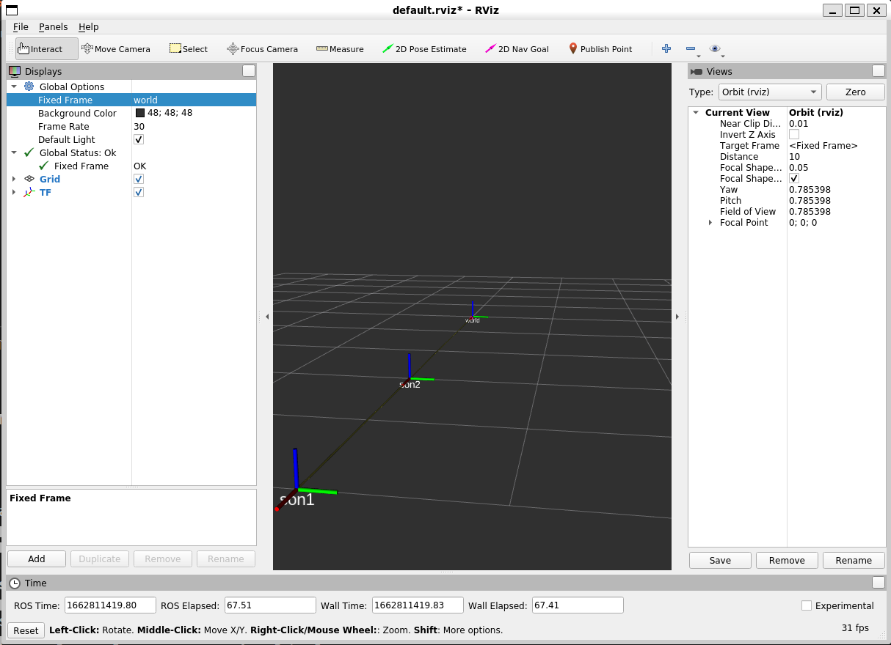

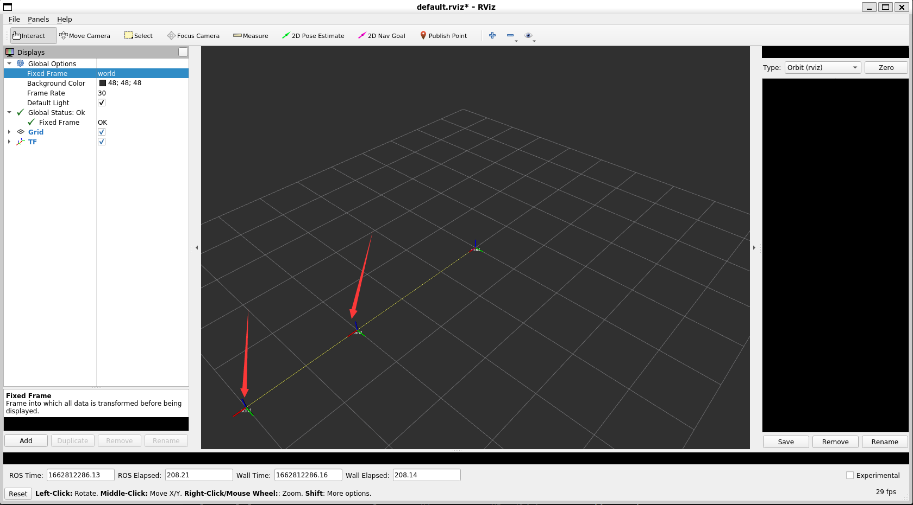

可以清晰看到 son1 和 son2 之间位置关系

## 2.6 坐标系关系查看

在机器人系统中，涉及的坐标系有多个，为了方便查看，ros 提供了专门的工具，可以用于生成显示坐标系关系的 pdf 文件，该文件包含树形结构的坐标系图谱。

### 2.6.1 下载 tf2_tools

`sudo apt install ros-noetic-tf2-tools`

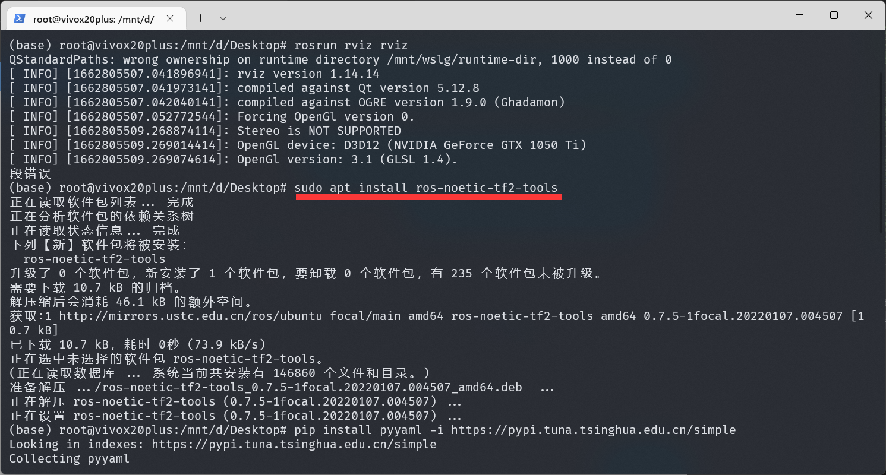

### 2.6.2 启动 son1 和 son2 节点

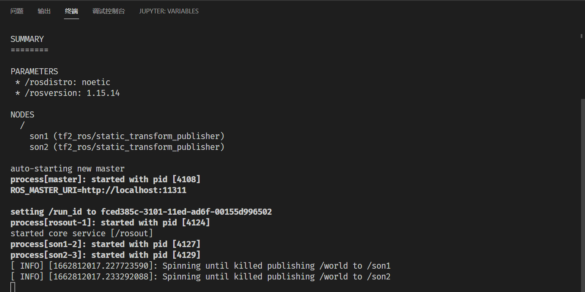

启动成功

### 2.6.3 生成 pdf 文件

输入`rosrun tf2_tools view_frames.py`

提示缺少两个包，进行安装

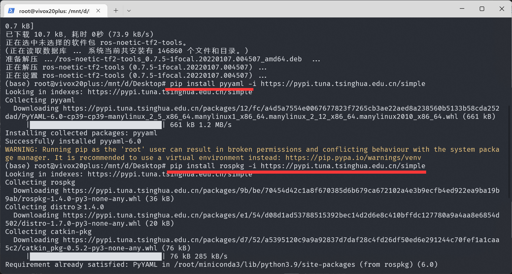

安装完成后，再次运行生成pdf

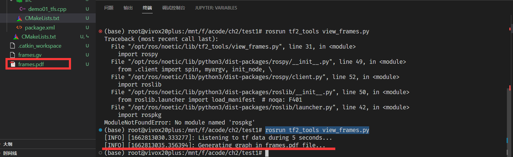

### 2.6.4 坐标系关系查看

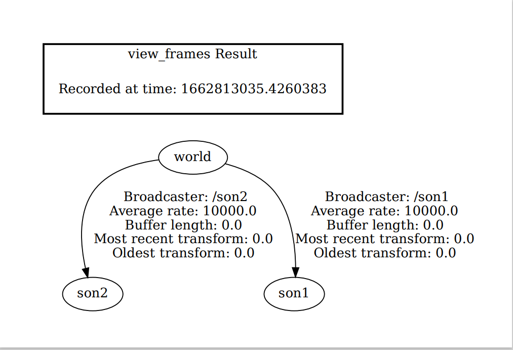

实验结束